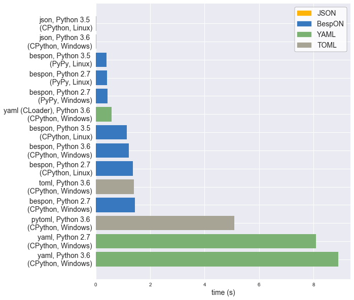

# BespON:  Bespoken Object Notation


BespON is a configuration language with several unique features.

  * **Multi-paradigm** – Do you like JSON's braces, brackets, and quotation
    marks?  Would you rather leave out some quotation marks and use
    significant indentation instead of braces and brackets?  Do you prefer
    INI-style sections, with no braces or brackets *and* no indentation?
    BespON supports all three styles.

  * **Extensible** – Support for several standard data types is built in,
    and other types may be supported soon using tag syntax.

  * **Round-trip enabled** – Many config languages lack parsers that can
    round-trip data.  Loading, modifying, and then saving can change data
    ordering, resulting in unnecessarily complicated diffs.  Even when a
    round-trip parser exists, comments may be lost or associated with the
    wrong data objects.  BespON is designed with round-tripping in mind,
    including doc comments that are uniquely associated with individual data
    objects and thus can be preserved through arbitrary data manipulation.

Take a look:

```text
# Line comments are allowed!  They can be round-tripped as long as data
# elements are only modified, not added or removed.

### This is a doc comment.  It can always be round-tripped.###
# Only one doc comment is allowed per object; another couldn't be here.

"quoted key with \x5C escapes" = 'quoted value with \u{5C} escapes'

`literal key without \ escapes` = ``literal value without `\` escapes``

# ASCII identifier-style strings are allowed unquoted.  Keys cannot contain
# spaces; values can contain single spaces and must be on one line.
# Unquoted Unicode identifiers can optionally be enabled.
unquoted_key = unquoted value

inline_dict = {key1 = value1, key2 = value2,}  # Trailing commas are fine.

inline_list_of_ints = [1, 0x12, 0o755, 0b1010]  # Hex, octal, and binary!

list_of_floats =
  * 1.2e3
  * -inf  # Full IEEE 754 compatibility.  Infinity and NaN are not excluded.
  * 0x4.3p2  # Hex floats, to avoid rounding issues.

wrapped_string = """string containing no whitespace lines in which line breaks
    are replaced with spaces, and "quotes" are possible by via delimiters"""

multiline_literal_string = |```
        A literal string in which linebreaks are kept (as '\n')
        and leading indentation (relative to delimiters) is preserved,
        with special delimiters always on lines by themselves.
    |```/

multiline_escaped_string = |"""
    The same idea as the literal string, but with backslash-escapes.
    |"""/

key1.key2 = true  # Key path style; same as "key1 = {key2 = true}"

|=== section.subsection  # Same as "section = {subsection = {key = value}}"
key = value
|===/  # Back to root level.  Can be omitted if sections never return to root.
```


## Why?

[](https://xkcd.com/927/)

Now the requisite XKCD reference is out of the way, why BespON?

  * **Comments**.  And doc comments that are uniquely associated with
    individual data objects, and thus may always be round-tripped correctly.
  * **Trailing commas**.
  * **Unquoted strings**.  But only identifier-style strings or unambiguous
    number-unit style strings (like `12pt`), and never broken across a line.
  * **Multiline strings** with indentation preserved *relative to delimiters*.
    Multiline strings with obvious leading/trailing whitespace, since it's
    inside delimiters.
  * **Integers**.  And integers with various bases (decimal, hex, octal,
    binary).
  * **Full IEEE 754 floating point support** (with infinity and NaN),
    including hex floats for cases when rounding errors aren't acceptable.
  * **Immutable data object model**.  Duplicate keys are invalid and must
    result in an error.
  * **A small list of special characters**.  Every ASCII punctuation character
    does NOT have its own, special meaning.  No constant wondering about what
    is allowed unquoted, and if it will appear as itself or something else.
  * **Sections and key paths** for conveniently representing nested data
    structures, without ending up with bracket soup or half a page width of
    indentation.
  * **"Acceptable" performance** even when completely implemented in an
    interpreted language.  (See the benchmarks below.)


## Getting started

A [Python implementation](https://github.com/gpoore/bespon_py) is available
now.  It supports loading and saving data.

There is also round trip support for changing the values of strings, floats,
ints, and bools.  For example,
```
>>> import bespon
>>> ast = bespon.loads_roundtrip_ast("""
key.subkey.first = 123   # Comment
key.subkey.second = 0b1101
key.subkey.third = `literal \string`
""")
>>> ast.replace_key(['key', 'subkey'], 'sk')
>>> ast.replace_val(['key', 'sk', 'second'], 7)
>>> ast.replace_val(['key', 'sk', 'third'], '\\another \\literal')
>>> ast.replace_key(['key', 'sk', 'third'], 'fourth')
>>> print(ast.dumps())

key.sk.first = 123   # Comment
key.sk.second = 0b111
key.sk.fourth = `\another \literal`
```
This example illustrates several of the round trip capabilities.

  * Comments and layout are preserved exactly.
  * Key renaming works with key paths.  Every time a key appears in key paths,
    it is renamed.
  * When a number is modified, the new value is expressed in the same base as
    the old value.
  * When a quoted string is modified, the new value is quoted in the same
    style as the old value (at least to the extent that this is practical).
  * As soon as a key is modified, the new key must be used for further
    modifications.  The old key is invalid.


There is also a
[language-agnostic test suite](https://github.com/bespon/bespon_tests),
which the Python implementation passes.


## Benchmarks

One of the goals for BespON is "acceptable" performance even when completely
implemented in an interpreted language.  So far, the pure Python
implementation is promising.  It only contains minimal optimizations
(avoidance of globals, use of `__slots__`), and has significant overhead
since it saves detailed source information about each data object to support
round tripping.  In spite of this, under CPython it can be only about 2 times
slower than LibYAML, the *C implementation* of YAML.  Under
[PyPy](http://pypy.org/), the pure Python implementation can actually be
significantly faster than LibYAML.  An implementation of BespON that left out
the round-trip data, or used [Cython](http://cython.org/), could likely be
even faster.

The benchmark data below was created using the
[BespON Python benchmark code](https://github.com/bespon/bespon_python_benchmark).
All data is from a single machine with Windows 10 and Ubuntu 16.04.
It should not be interpreted as making a definitive statement about BespON
performance under Python, since that will depend on the nature of specific
data sets and the features used to represent them.  Nevertheless, it does
indicate that BespON performance can be competitive with that of similar
formats.



The data from the plot is duplicated below in text form.  It also includes
additional JSON data that was omitted from the plot to improve clarity.

```text
PACKAGE                                           TIME (s)
----------------------------------------------------------
json, Python 2.7 (PyPy, Linux):                   0.010970
json, Python 3.5 (CPython, Linux):                0.015541
json, Python 3.6 (CPython, Windows):              0.017222
json, Python 2.7 (PyPy, Windows):                 0.018549
json, Python 3.5 (PyPy, Linux):                   0.025390
json, Python 2.7 (CPython, Linux):                0.031828
json, Python 2.7 (CPython, Windows):              0.033475
bespon, Python 3.5 (PyPy, Linux):                 0.395049
bespon, Python 2.7 (PyPy, Linux):                 0.419876
bespon, Python 2.7 (PyPy, Windows):               0.434258
yaml (CLoader), Python 3.6 (CPython, Windows):    0.583341
bespon, Python 3.5 (CPython, Linux):              1.136635
bespon, Python 3.6 (CPython, Windows):            1.221588
bespon, Python 2.7 (CPython, Linux):              1.374798
toml, Python 3.6 (CPython, Windows):              1.404044
bespon, Python 2.7 (CPython, Windows):            1.436316
pytoml, Python 3.6 (CPython, Windows):            5.091966
yaml, Python 2.7 (CPython, Windows):              8.091318
yaml, Python 3.6 (CPython, Windows):              8.910164
```


## Stability

All current features are expected to be stable.  The objective is a final
version 1.0 of the Python implementation by the end of summer 2017.


## Specification

A [brief overview](spec_overview.md) is currently available.  More
technical details are in the Python implementation, particularly in
`grammar.py` and `re_patterns.py`.  A more formal, more detailed
specification will follow as soon as the Python implementation is refined
further.
