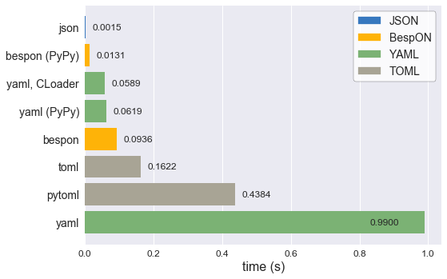

# BespON – Bespoken Object Notation


BespON is a configuration language designed for the tasks that aren't
convenient in the other formats.

  * **Multi-paradigm** – Do you like braces, brackets, and explicit quotation
    marks, with no significant whitespace?  Would you rather leave out some
    quotation marks and use significant indentation instead of braces and
    brackets?  Do you prefer INI-style sections, with no braces or brackets
    *and* no indentation?  BespON supports all three styles.

  * **Strings and numbers** – Literal and escaped multiline strings designed
    for storing template text.  Floats *and* integers, in multiple bases,
    with full IEEE 754 support.

  * **Lossless round-tripping** – Designed to be loaded by a computer,
    modified, and then saved while retaining exact layout, including comments.

Take a look:

<div style="padding: 1em;color: #d4d4d4;background-color: #1e1e1e;font-family: Consolas, 'Courier New', monospace;font-weight: normal;font-size: 14px;line-height: 19px;white-space: pre;"><div><span style="color: #608b4e;"># Line comments are allowed!  They can always be round-tripped as long as data</span></div><div><span style="color: #608b4e;"># elements are only modified, not added or removed.</span></div><br><div><span style="color: #608b4e;">### This is a doc comment.  It can always be round-tripped.###</span></div><div><span style="color: #608b4e;"># Only one doc comment is allowed per object; another couldn't be here.</span></div><br><div><span style="color: #ce9178;">"quoted key with \x5C escapes"</span><span style="color: #d4d4d4;"> = </span><span style="color: #ce9178;">'quoted value with \u{5C} escapes'</span></div><br><div><span style="color: #ce9178;">`literal key without \ escapes`</span><span style="color: #d4d4d4;"> = </span><span style="color: #ce9178;">``literal value without `\` escapes``</span></div><br><div><span style="color: #608b4e;"># ASCII identifier-style strings are allowed unquoted.</span></div><div><span style="color: #608b4e;"># Unquoted Unicode identifiers can optionally be enabled.</span></div><div><span style="color: #ce9178;">unquoted_key</span><span style="color: #d4d4d4;"> = </span><span style="color: #ce9178;">unquoted_value</span></div><br><div><span style="color: #ce9178;">inline_dict</span><span style="color: #d4d4d4;"> = {</span><span style="color: #ce9178;">key1</span><span style="color: #d4d4d4;"> = </span><span style="color: #ce9178;">value1</span><span style="color: #d4d4d4;">, </span><span style="color: #ce9178;">key2</span><span style="color: #d4d4d4;"> = </span><span style="color: #ce9178;">value2</span><span style="color: #d4d4d4;">,}  </span><span style="color: #608b4e;"># Trailing commas are fine.</span></div><br><div><span style="color: #ce9178;">inline_list_of_ints</span><span style="color: #d4d4d4;"> = [</span><span style="color: #b5cea8;">1</span><span style="color: #d4d4d4;">, </span><span style="color: #569cd6;">0x</span><span style="color: #b5cea8;">12</span><span style="color: #d4d4d4;">, </span><span style="color: #569cd6;">0o</span><span style="color: #b5cea8;">755</span><span style="color: #d4d4d4;">, </span><span style="color: #569cd6;">0b</span><span style="color: #b5cea8;">1010</span><span style="color: #d4d4d4;">]  </span><span style="color: #608b4e;"># Hex, octal, and binary!</span></div><br><div><span style="color: #ce9178;">list_of_floats</span><span style="color: #d4d4d4;"> =</span></div><div><span style="color: #d4d4d4;">  * </span><span style="color: #b5cea8;">1.2e3</span></div><div><span style="color: #d4d4d4;">  * </span><span style="color: #b5cea8;">-inf</span><span style="color: #d4d4d4;">  </span><span style="color: #608b4e;"># Full IEEE 754 compatibility.  Infinity and NaN are not excluded.</span></div><div><span style="color: #d4d4d4;">  * </span><span style="color: #569cd6;">0x</span><span style="color: #b5cea8;">4.3p2</span><span style="color: #d4d4d4;">  </span><span style="color: #608b4e;"># Hex floats, to avoid rounding issues.</span></div><br><div><span style="color: #ce9178;">wrapped_string</span><span style="color: #d4d4d4;"> = </span><span style="color: #ce9178;">"""string containing no whitespace lines in which line breaks</span></div><div><span style="color: #ce9178;">    are replaced with spaces, and "quotes" are possible by via delimiters"""</span></div><br><div><span style="color: #ce9178;">multiline_literal_string</span><span style="color: #d4d4d4;"> = </span><span style="color: #ce9178;">|```</span></div><div><span style="color: #ce9178;">        A literal string in which linebreaks are kept (as '\n')</span></div><div><span style="color: #ce9178;">        and leading indentation (relative to delimiters) is preserved,</span></div><div><span style="color: #ce9178;">        with special delimiters always on lines by themselves.</span></div><div><span style="color: #ce9178;">    |```/</span></div><br><div><span style="color: #ce9178;">multiline_escaped_string</span><span style="color: #d4d4d4;"> = </span><span style="color: #ce9178;">|"""</span></div><div><span style="color: #ce9178;">    The same idea as the literal string, but with backslash escapes.</span></div><div><span style="color: #ce9178;">    |"""/</span></div><br><div><span style="color: #ce9178;">key1</span><span style="color: #d4d4d4;">.</span><span style="color: #ce9178;">key2</span><span style="color: #d4d4d4;"> = </span><span style="color: #569cd6;">true</span><span style="color: #d4d4d4;">  </span><span style="color: #608b4e;"># Key path style; same as "key1 = {key2 = true}"</span></div><br><div><span style="color: #d4d4d4;">|=== </span><span style="color: #ce9178;">section</span><span style="color: #d4d4d4;">.</span><span style="color: #ce9178;">subsection</span><span style="color: #d4d4d4;">  </span><span style="color: #608b4e;"># Same as "section = {subsection = {key = value}}"</span></div><div><span style="color: #ce9178;">key</span><span style="color: #d4d4d4;"> = </span><span style="color: #ce9178;">value</span></div><div><span style="color: #d4d4d4;">|===/  </span><span style="color: #608b4e;"># Back to root level.  Can be omitted if sections never return to root.</span></div><br></div>

<br>


## Why?

[](https://xkcd.com/927/)

Now that the requisite XKCD reference is out of the way, why BespON?

  * **Comments**.  Instead of not having comments.  Normal comments aren't
    uniquely associated with individual data elements (or necessarily with
    data at all), so BespON also provides doc comments.  Only one doc comment
    is allowed per data element.  This brings the possibility of
    round-tripping with arbitrary data manipulation while retaining all (doc)
    comments.
  * **Trailing commas**.
  * **Unquoted strings**.  But only identifier-style strings, and only strings
    that do NOT match reserved words like `true` under any capitalization.
  * **Consistent reserved words**.  `true` is *always* boolean True.  It isn't
    boolean True or the string "true" depending on whether it happens to
    appear as a dict key or as a dict value.
  * **Multiline strings** that take into account the needs of storing template
    text.  Indentation is preserved *relative to delimiters*.
    Leading/trailing whitespace is obvious, since it's inside delimiters.
    Opening delimiters are different than closing delimiters, so it's easy to
    distinguish the start of a multiline string from the end when working with
    long templates.  Both literal multiline strings and multiline strings
    with backslash escapes are supported.
  * **Integers**.  And integers with various bases (decimal, hex, octal,
    binary).
  * **Full IEEE 754 floating point support** with Infinity and NaN,
    including hex floats for cases when rounding errors aren't acceptable.
  * **Immutable data object model**.  Duplicate keys in dicts are invalid and
    must result in an error.
  * **A small list of special characters**.  Every ASCII punctuation character
    does NOT have its own, special meaning.  No constant wondering about what
    is allowed unquoted, and if it will appear as itself or something else.
  * **Sections and key paths** for conveniently representing nested data
    structures, without ending up with bracket soup or half a page width of
    indentation.
  * **"Acceptable" performance** even when completely implemented in an
    interpreted language (see the benchmarks below).


## Getting started

A [**Python implementation**](https://github.com/gpoore/bespon_py) is available
now.  It supports loading and saving data.  There is also round-trip support
for changing the values of strings, floats, ints, and bools (changing types
is not currently supported).  For example,
```
>>> import bespon
>>> ast = bespon.loads_roundtrip_ast("""
key.subkey.first = 123   # Comment
key.subkey.second = 0b1101
key.subkey.third = `literal \string`
""")
>>> ast.replace_key(['key', 'subkey'], 'sk')
>>> ast.replace_val(['key', 'sk', 'second'], 7)
>>> ast.replace_val(['key', 'sk', 'third'], '\\another \\literal')
>>> ast.replace_key(['key', 'sk', 'third'], 'fourth')
>>> print(ast.dumps())

key.sk.first = 123   # Comment
key.sk.second = 0b111
key.sk.fourth = `\another \literal`
```
This illustrates several of the round-trip capabilities.

  * Comments and layout are preserved exactly.
  * Key renaming works with key paths.  Every time a key appears in key paths,
    it is renamed.
  * When a number is modified, the new value is expressed in the same base as
    the old value.
  * When a quoted string is modified, the new value is quoted in the same
    style as the old value (at least to the extent that this is practical).
  * As soon as a key is modified, the new key must be used for further
    modifications.  The old key is invalid.


There is a
[**syntax highlighting extension**](https://github.com/bespon/bespon_vscode)
for Visual Studio Code.  It has been posted to the Visual Studio Marketplace,
so it can be installed with the built-in extension manager.

There is a
[**language-agnostic test suite**](https://github.com/bespon/bespon_tests),
which the Python implementation passes.


## Benchmarks

One of the goals for BespON is "acceptable" performance even when completely
implemented in an interpreted language.  So far, the pure Python
implementation is promising.  It contains minimal optimizations (avoidance of
globals, use of `__slots__`), and has significant overhead since it saves
detailed source information about each data object to support round-tripping.
In spite of this, when decoding under CPython it can be only about 2 times
slower than PyYAML using LibYAML, the *C implementation* of YAML.  Under
[PyPy](http://pypy.org/), the pure Python implementation can actually be
significantly faster than LibYAML.  An implementation of BespON that left out
the round-trip data, or used [Cython](http://cython.org/), could likely be
even faster.

The decoding benchmark data below was created using the
[BespON Python benchmark code](https://github.com/bespon/bespon_python_benchmark).
All data is from a single machine with Windows 10 and Ubuntu 16.04.
It should not be interpreted as making a definitive statement about BespON
performance under Python, since that will depend on the nature of specific
data sets and the features used to represent them.  Nevertheless, it does
indicate that BespON performance can be competitive with that of similar
formats.



The data from the plot is duplicated below in text form.  It also includes
additional JSON data that was omitted from the plot to improve clarity.

```text
PACKAGE                                           TIME (s)
----------------------------------------------------------
json, Python 2.7 (PyPy, Linux):                   0.010970
json, Python 3.5 (CPython, Linux):                0.015541
json, Python 3.6 (CPython, Windows):              0.017222
json, Python 2.7 (PyPy, Windows):                 0.018549
json, Python 3.5 (PyPy, Linux):                   0.025390
json, Python 2.7 (CPython, Linux):                0.031828
json, Python 2.7 (CPython, Windows):              0.033475
bespon, Python 3.5 (PyPy, Linux):                 0.395049
bespon, Python 2.7 (PyPy, Linux):                 0.419876
bespon, Python 2.7 (PyPy, Windows):               0.434258
yaml (CLoader), Python 3.6 (CPython, Windows):    0.583341
bespon, Python 3.5 (CPython, Linux):              1.136635
bespon, Python 3.6 (CPython, Windows):            1.221588
bespon, Python 2.7 (CPython, Linux):              1.374798
toml, Python 3.6 (CPython, Windows):              1.404044
bespon, Python 2.7 (CPython, Windows):            1.436316
pytoml, Python 3.6 (CPython, Windows):            5.091966
yaml, Python 2.7 (CPython, Windows):              8.091318
yaml, Python 3.6 (CPython, Windows):              8.910164
```


## Stability

All current features are expected to be stable.  The objective is a final
version 1.0 of the Python implementation by the end of summer 2017.


## Specification

A [brief overview](spec_overview.md) is currently available.  More
technical details are in the Python implementation, particularly in
`grammar.py` and `re_patterns.py`.  A more formal, more detailed
specification will follow as soon as the Python implementation is refined
further.
